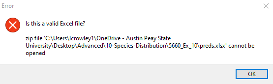

```{r setup, include=FALSE}
knitr::opts_chunk$set(echo = TRUE)

library(cowplot)
library(dismo)
library(leaflet)
library(mapdata)
library(rasterVis)
library(rdryad)
library(rgbif)
library(sf)
library(tidyverse)

```

# DISMO

```{r DISMO1, echo=TRUE}

beavers.dismo <- gbif("castor", species = "canadensis", ext = c(-91,-81,34,37),
                   geo = TRUE, download = TRUE, removeZeros = TRUE)

```

```{r DISMO2, echo=FALSE}

us <- map_data("state")

ggplot() +
  geom_polygon(data = us, aes(x=long, y = lat, group = group),
               fill = "white", color="black") +
  geom_point(data = beavers.dismo, aes(x=lon, y=lat)) + 
  xlab("Longitude") + ylab("Latitude") +
  coord_fixed(xlim = c(-91,-81), ylim = c(34,37)) +
  xlab("Longitude") + ylab("Latitude") + ggtitle("Beavers (Castor Canadensis) in and around Tennessee") + 
  theme_bw() + theme(plot.title = element_text(hjust = 0.5)) + 
  theme(panel.grid.major = element_blank(), 
        panel.grid.minor = element_blank(),
        panel.background = element_rect(fill = "darkslategray2"))
```

# GBIF

```{r GBIF1}
beavers.rgbif <- occ_data(scientificName = "Castor canadensis",
                       hasCoordinate = TRUE, limit = 2000,
                       decimalLongitude = "-91, -81", 
                       decimalLatitude = "34, 37")

otters.rgbif <- occ_data(scientificName = "Lontra canadensis",
                       hasCoordinate = TRUE, limit = 2000,
                       decimalLongitude = "-91, -81", 
                       decimalLatitude = "34, 37")
```

```{r GBIF2}

beavers.rgbif.df <- cbind.data.frame(beavers.rgbif$data$species,
                                  beavers.rgbif$data$decimalLatitude,
                                  beavers.rgbif$data$decimalLongitude,
                                  beavers.rgbif$data$stateProvince,
                                  beavers.rgbif$data$verbatimLocality)

otters.rgbif.df <- cbind.data.frame(otters.rgbif$data$species,
                                  otters.rgbif$data$decimalLatitude,
                                  otters.rgbif$data$decimalLongitude,
                                  otters.rgbif$data$stateProvince,
                                  otters.rgbif$data$verbatimLocality)

colnames(beavers.rgbif.df) <- c("species","y","x","state","location")
colnames(otters.rgbif.df) <- c("species","y","x","state","location")
```

```{r GBIF3}

ggplot() +
  geom_polygon(data = us, aes(x=long, y = lat, group = group),
               fill = "white", color="black") +
  geom_point(data = beavers.rgbif.df, aes(x=x, y=y, color = species), size = 3) +
  geom_point(data = otters.rgbif.df, aes(x=x, y=y, color = species), size = 3) +  
  coord_fixed(xlim = c(-91,-81), ylim = c(34, 37)) +
  xlab("Longitude") + ylab("Latitude") + ggtitle("Beavers and otters in and around Tennessee") + 
  guides(color=guide_legend("Legend", override.aes = list(size = 4))) +
  theme_bw() + theme(plot.title = element_text(hjust = 0.5)) + 
  theme(legend.position = "bottom") +
  theme(legend.title.align = 0.5, legend.box.just = "center") +
  theme(panel.grid.major = element_blank(), 
        panel.grid.minor = element_blank(),
        panel.background = element_rect(fill = "darkslategray2"))

```

# DRYAD



I lost count of how many data sets I tried and how many different things I changed around. This message came up *every time*. Zipped, unzipped, large file, small file, whatever. It just wasn't working. I eventually just copy-pasted from a downloaded DRYAD set about crayfish in Panama, found [here](https://datadryad.org/stash/dataset/doi:10.5061/dryad.n02v6wwss).

# INSET MAP

```{r BASE MAP}

fish <- read.csv("CRAWFISH.csv")

world <- map_data("worldHires")
panama <-map_data("worldHires", "USA")

main_map <- ggplot() +
  geom_polygon(data = world, aes(x=long, y = lat, group = group),
               fill = "gray", color="white") +
  geom_polygon(data = panama, aes(x=long, y = lat, group = group),
               fill = "white", color="black") +
  geom_point(data = fish, aes(X, Y, color = age)) +
  coord_fixed(xlim = c(29,31), ylim = c(-85,-86)) +
  xlab("Longitude") + ylab("Latitude") + ggtitle("Crayfish - Question Mark") + 
  guides(color=guide_legend("Age", override.aes = list(size = 3))) +  
  theme_bw() + theme(plot.title = element_text(hjust = 0.5)) + 
  theme(legend.position = "right") +
  theme(legend.title.align = 0.5, legend.box.just = "center") +
  theme(panel.grid.major = element_blank(), 
        panel.grid.minor = element_blank(),
        panel.background = element_rect(fill = "lightblue"))

main_map

```


```{r INSET MAP 1}

inset <- ggplot() + 
  geom_polygon(data = world, aes(x=long, y = lat, group = group),
               fill = "gray", color="white") +
  geom_polygon(data = panama, aes(x=long, y = lat, group = group),
               fill = "slategray", color="black") +
  coord_map(xlim = c(-74,-94), ylim = c(25,35), "polyconic") +
  theme(panel.background = element_rect(fill = "lightblue"), panel.grid.major = element_blank(), panel.grid.minor = element_blank(), 
        axis.line=element_blank(), axis.text.x=element_blank(), axis.text.y=element_blank(),axis.ticks=element_blank(), 
        axis.title.x=element_blank(), axis.title.y=element_blank()) +
  theme(plot.margin=grid::unit(c(0,0,0,0), "mm"))
inset


```

```{r INSET MAP 2}

ggdraw() +
  draw_plot(main_map) + 
  draw_plot(inset, x = 0.024, y = 0.595, width = 0.25, height = 0.25)

```
# Anyway...
```{r SIMPLE S.D. MAP}

bioclim <- getData(name = "worldclim", res = 2.5, var = "bio", path = "./")

names(bioclim) <- c("Ann Mean Temp","Mean Diurnal Range","Isothermality","Temperature Seasonality",
                    "Max Temp Warmest Mo","Min Temp Coldest Mo","Ann Temp Range","Mean Temp Wettest Qtr",
                    "Mean Temp Driest Qtr","Mean Temp Warmest Qtr","Mean Temp Coldest Qtr","Annual
                    Precip","Precip Wettest Mo","Precip Driest Mo","Precip Seasonality","Precip Wettest
                    Qtr","Precip Driest Qtr","Precip Warmest Qtr","Precip Coldest Qtr")

bio.extent <- extent(x = c(
  min(beavers.rgbif.df$x),
  max(beavers.rgbif.df$x),
  min(beavers.rgbif.df$y),
  max(beavers.rgbif.df$y)))

bioclim.extent <- crop(x = bioclim, y = bio.extent)

bioclim.model <- bioclim(x = bioclim.extent, p = cbind(beavers.rgbif.df$x, beavers.rgbif.df$y))
presence.model <- dismo::predict(object = bioclim.model, 
                                 x = bioclim.extent, 
                                 ext = bio.extent)

```
```{r SIMPLE MAP 2}

rasterVis::gplot(presence.model) + 
  geom_polygon(data = us, aes(x= long, y = lat, group = group),
               fill = "gray", color="black") +
  geom_raster(aes(fill=value)) +
  geom_polygon(data = us, aes(x= long, y = lat, group = group),
               fill = NA, color="black") +
  geom_point(data = beavers.rgbif.df, aes(x = x, y = y), size = 2, color = "black", alpha = 0.5) +
  scale_fill_gradientn(colours=c("brown","yellow","darkgreen"), "Probability") +
  coord_fixed(xlim = c(-91,-81), ylim = c(34,37)) +
  xlab("Longitude") + ylab("Latitude") + ggtitle("Probability of Castor canadensis Occurrence") + 
  theme_bw() + theme(plot.title = element_text(hjust = 0.5)) + theme(legend.position = "right") +
  theme(panel.grid.major = element_blank(), 
        panel.grid.minor = element_blank(),
        panel.background = element_rect(fill = "lightblue"))

```

```{r SIMPLE MAP 3}

rasterVis::gplot(presence.model) + 
  geom_polygon(data = us, aes(x= long, y = lat, group = group),
               fill = "gray", color="black") +
  geom_raster(aes(fill=value)) +
  geom_polygon(data = us, aes(x= long, y = lat, group = group),
               fill = NA, color="black") +
  geom_point(data = otters.rgbif.df, aes(x = x, y = y), size = 2, color = "black", alpha = 0.5) +
  scale_fill_gradientn(colours=c("brown","yellow","darkgreen"), "Probability") +
  coord_fixed(xlim = c(-91,-81), ylim = c(34,37)) +
  xlab("Longitude") + ylab("Latitude") + ggtitle("Probability of Lontra canadensis Occurrence") + 
  theme_bw() + theme(plot.title = element_text(hjust = 0.5)) + theme(legend.position = "right") +
  theme(panel.grid.major = element_blank(), 
        panel.grid.minor = element_blank(),
        panel.background = element_rect(fill = "lightblue"))

```